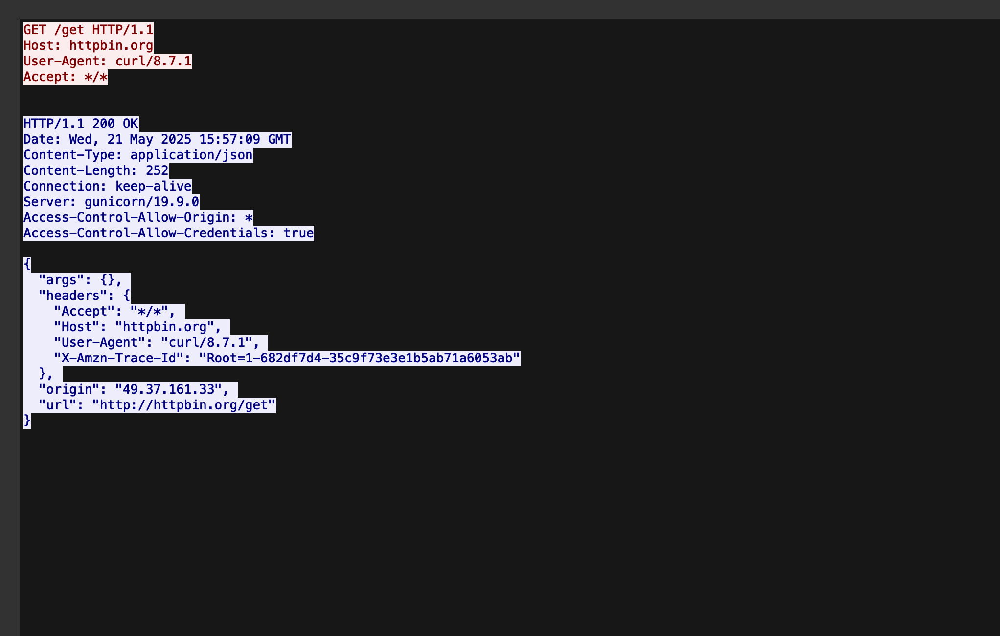

# HTTP GET Request Analysis

This document summarizes an HTTP GET request and response captured using Wireshark.

## 🧪 Test Details
- Tool Used: `curl http://httpbin.org/get`
- Protocol: HTTP/1.1 (port 80)
- Traffic: Unencrypted, captured in plain text

## ✅ Observations

### Request:
GET /get HTTP/1.1
Host: httpbin.org
User-Agent: curl/8.7.1
Accept: /

### Response:
- Status: `HTTP/1.1 200 OK`
- Content-Type: `application/json`
- Server: `gunicorn/19.9.0`
- Origin IP: `49.37.161.33`
- Returned JSON includes request metadata

## 📸 Screenshot

## 🧠 What I Learned
- How to capture and analyze HTTP requests in Wireshark
- Differences between HTTP and HTTPS traffic visibility
- How TCP streams reconstruct full application-level conversations

