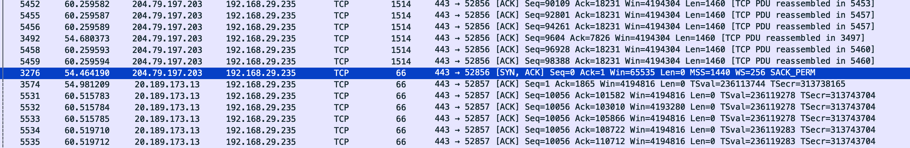

# TCP 3-Way Handshake Analysis

This document analyzes a captured TCP handshake between a local client and a remote server on port 443.

## 🔁 Handshake Breakdown

| Step | Description | Packet Info |
|------|-------------|-------------|
| 1    | SYN         | Initiated by 192.168.29.235 |
| 2    | SYN-ACK     | Server (204.79.197.203) responds with acknowledgment |
| 3    | ACK         | Client confirms and completes connection |

## 📈 Screenshot

## 🧠 What I Learned

- How TCP establishes connections before data transfer
- How SYN, SYN-ACK, and ACK packets behave in sequence
- How to filter TCP packets and identify handshake patterns in Wireshark

